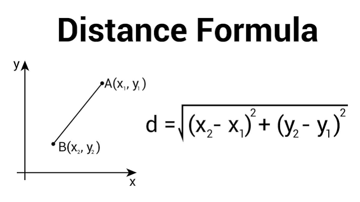
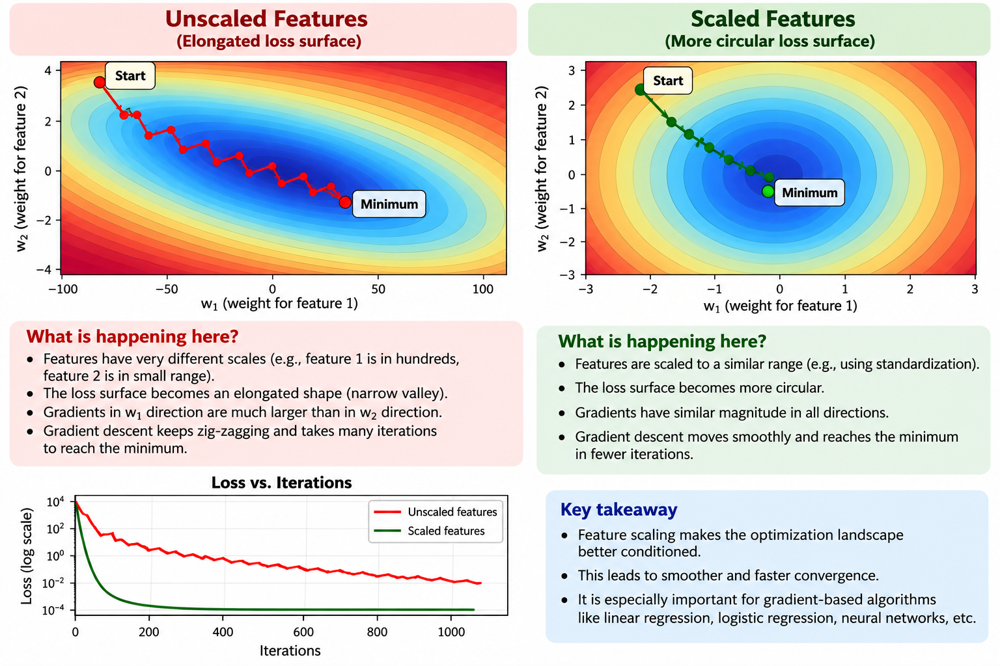

# Why Feature Scaling Matters in Machine Learning

Feature scaling transforms numerical features so that they are on comparable scales.

> **Core idea:** Feature scaling prevents a feature from having disproportionate influence simply because its numerical values are larger.

---

## 1. Distance-Based Algorithms

Distance-based algorithms are sensitive to feature magnitude.

Examples:

- K-Nearest Neighbors (KNN)
- K-Means
- Hierarchical Clustering
- DBSCAN
- SVM with RBF kernel

### Example: KNN

Suppose we have:

- **Age:** 20–60
- **Salary:** ₹20,000–₹2,00,000

The Euclidean distance is:



Salary has much larger numerical values, so it can dominate the distance.

Even if Age and Salary are equally important for the prediction, the distance may be driven mostly by Salary.

After scaling, both features are placed on comparable scales, so one does not dominate simply because of its units.

### Interview explanation

> **"Distance-based algorithms are sensitive to feature magnitude. If one feature has much larger numerical values than another, it can dominate the distance calculation. Feature scaling puts the features on comparable scales so that distance is not dominated by numerical magnitude."**

---

# 2. Gradient-Based Optimization

Feature scaling can also improve optimization for algorithms that use gradients.

Examples:

- Linear Regression trained using gradient descent
- Logistic Regression
- Neural Networks
- Other gradient-based optimization methods

### What happens without scaling?

Suppose:

```text
Feature 1 → small numerical range
Feature 2 → very large numerical range
```

The loss surface can become **elongated**, creating a narrow valley.

Gradient descent may then zig-zag:

```text
Start
  ↘
    ↗
      ↘
        ↗
          ↘
            ● Minimum
```

This can require more iterations to reach the minimum.

### Why does feature scale affect the gradient?

For a simple linear model:

ŷ = w₁x₁ + w₂x₂


The gradient with respect to a weight depends partly on the corresponding feature:

∂L/∂wⱼ ∝ xⱼ

Therefore, features with very different scales can produce gradients with very different magnitudes.

This can make the optimization landscape poorly conditioned and cause inefficient zig-zagging.

### Important clarification

Do **not** say:

> "Gradient descent optimizes the larger feature first."

Instead say:

> **"Different feature scales can produce very different gradient magnitudes, which can make optimization poorly conditioned and slow convergence."**

---

# 3. Geometric Intuition



---

# 4. Unscaled vs Scaled

| Unscaled Features | Scaled Features |
|---|---|
| Features can have very different magnitudes | Features have comparable magnitudes |
| Large feature can dominate distance | Distance is more balanced |
| Loss surface can be elongated | Loss surface can be better conditioned |
| Gradients can have very different magnitudes | Gradient magnitudes become more comparable |
| Gradient descent can zig-zag | Gradient descent can move more directly |
| May require more iterations | Can converge in fewer iterations |

> **Scaling does not create new information. It changes the numerical representation so that the algorithm can work with the features more effectively.**

---

# 5. Algorithms That Usually Need Scaling

### Distance-based

- KNN
- K-Means
- Hierarchical Clustering
- DBSCAN
- SVM with RBF and other distance-based kernels

### Gradient-based

- Logistic Regression
- Linear Regression with gradient descent
- Neural Networks
- Other gradient-based optimization algorithms

### Regularized models

Scaling is also important for models with regularization:

- Ridge Regression
- Lasso Regression
- Elastic Net
- Regularized Logistic Regression

The reason is that regularization penalizes coefficients. When features are on very different scales, coefficient magnitudes are not directly comparable, so the penalty can affect features differently because of their scale.

---

# 6. Algorithms That Usually Do Not Need Scaling

Tree-based algorithms generally do not require feature scaling.

Examples:

- Decision Tree
- Random Forest
- Gradient Boosting
- XGBoost
- LightGBM
- CatBoost

### Why?

Trees make decisions using thresholds:

\[
Age < 30
\]

or:

\[
Salary < 50,000
\]

Scaling changes the threshold value but not the basic ordering of observations.

For example:

```text
Original:
Salary < 50,000

After scaling:
Scaled Salary < 0.42
```

The tree can still make the corresponding split.

---


# 7. Important Practical Rule: Avoid Data Leakage

Fit the scaler **only on the training data**.

Correct workflow:

```text
Training data
      ↓
Fit scaler
      ↓
Transform training data
      ↓
Transform validation/test data
```

Example:

```python
from sklearn.preprocessing import StandardScaler

scaler = StandardScaler()

X_train_scaled = scaler.fit_transform(X_train)
X_test_scaled = scaler.transform(X_test)
```

Use:

```python
fit_transform(X_train)
```

but only:

```python
transform(X_test)
```

The test set must not be used to calculate the scaling parameters.

---

# 8. Interview-Ready Answer

If asked:

### "Why do we need feature scaling?"

> **"Feature scaling is important because some ML algorithms are sensitive to feature magnitude. For distance-based algorithms such as KNN and K-Means, a feature with a larger numerical range can dominate the distance calculation. Scaling puts features on comparable scales. It is also useful for gradient-based optimization because differently scaled features can produce gradients of very different magnitudes, making the optimization landscape poorly conditioned and causing gradient descent to converge less efficiently and slowly. Tree-based models generally don't require scaling because their decisions are based on feature thresholds rather than distances."**

---

# 9. Mental Model

Remember two major reasons:

```text
                 Feature Scaling
                       │
             ┌─────────┴─────────┐
             │                   │
      Distance-based       Gradient-based
         algorithms          optimization
             │                   │
       Large feature        Different feature
       can dominate         scales → different
       distance             gradient magnitudes
             │                   │
             ↓                   ↓
       Fairer distance       Better-conditioned
         calculation         optimization
                                 │
                                 ↓
                          Faster convergence
```

### One-line memory trick

> **Distance → prevent magnitude domination.**  
> **Gradient → improve the optimization landscape.**
